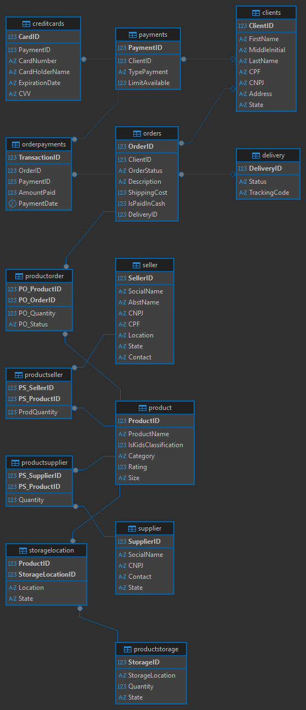

# Análise de Dados de E-commerce com SQL


Este projeto consiste na criação, carga de dados e análise de um banco de dados relacional para um sistema de e-commerce. O objetivo principal é demonstrar a capacidade de transformar dados brutos em inteligência de negócio, utilizando exclusivamente a linguagem SQL para responder a perguntas estratégicas.

---

### Tabela de Conteúdos
* [Visão Geral do Projeto](#visão-geral-do-projeto)
* [Diagrama Entidade-Relacionamento (DER)](#diagrama-entidade-relacionamento-der)
* [Ferramentas e Tecnologias](#ferramentas-e-tecnologias)
* [Como Executar o Projeto](#como-executar-o-projeto)
* [Análises e Insights (Queries)](#análises-e-insights-queries)

---

### 🎯 Visão Geral do Projeto

A análise de dados é importante para entender o comportamento do consumidor, gerenciar o estoque e impulsionar o crescimento do negócio. O projeto simula um ambiente de banco de dados real, onde foram estruturadas tabelas para armazenar informações sobre clientes, produtos, pedidos, fornecedores e vendedores. A partir dessa base, foram desenvolvidas consultas SQL focadas em extrair métricas operacionais e estratégicas.

### 📊 Diagrama Entidade-Relacionamento (DER)

O schema do banco de dados foi projetado para garantir a integridade e o relacionamento lógico entre as entidades principais de um e-commerce.



**Principais Entidades:**
* **Clientes:** Dados cadastrais, com distinção entre Pessoa Física e Jurídica.
* **Produtos:** Informações sobre itens à venda.
* **Pedidos:** Registro de transações, incluindo custos e status.
* **Fornecedores/Vendedores:** Entidades que fornecem ou vendem produtos na plataforma.

---

### 🛠️ Ferramentas e Tecnologias

* **Sistema de Gerenciamento de Banco de Dados:** MySQL
* **Linguagem:** SQL (padrão ANSI)
* **Cliente de Banco de Dados:** DBeaver

---

### 🚀 Como Executar o Projeto

Para recriar o ambiente e executar as análises em seu computador:

1.  **Clone o Repositório:**
    ```bash
    git clone https://github.com/fernandatollotti/ecommerce.git
    cd ecommerce
    ```

2.  **Crie o Banco de Dados:**
    Acesse seu cliente SQL (como o DBeaver) e crie o banco de dados.
    ```sql
    CREATE DATABASE ecommerce;
    USE ecommerce;
    ```

3.  **Crie as Tabelas (Schema):**
    Execute o script `database/schema.sql` para criar toda a estrutura do banco.

4.  **Popule o Banco de Dados:**
    Execute o script `database/inserts.sql` para adicionar os dados de exemplo (clientes, produtos, pedidos, etc.).

5.  **Execute as Análises:**
    Abra o arquivo `database/queries.sql` em seu DBeaver e execute as consultas para visualizar os resultados.

---

### 📈 Análises e Insights (Queries)

O arquivo `database/queries.sql` contém as consultas desenvolvidas para responder a questões-chave do negócio.

#### Foco no Cliente e Vendas
* **Frequência de Compra:** Quantidade total de pedidos realizados por cada cliente.
* **Clientes Mais Valiosos:** Ranqueamento dos clientes por valor total gasto.
* **Perfil do Cliente:** Segmentação entre Pessoa Física e Pessoa Jurídica.
* **Visão Detalhada do Pedido:** Quem comprou o quê, quantidade por produto e forma de pagamento utilizada.

#### Gestão de Produto e Operações
* **Produtos Mais Vendidos:** Identificação dos produtos com maior volume de vendas.
* **Rastreamento de Estoque:** Relação detalhada de produtos, seus fornecedores, quantidade em estoque e localização de armazenamento.
* **Inteligência de Parcerias:** Verificação se há sobreposição de papéis (se algum vendedor também atua como fornecedor) no ecossistema da loja.
* **Relação Fornecedor-Produto:** Listagem completa de quais produtos são fornecidos por cada parceiro.
